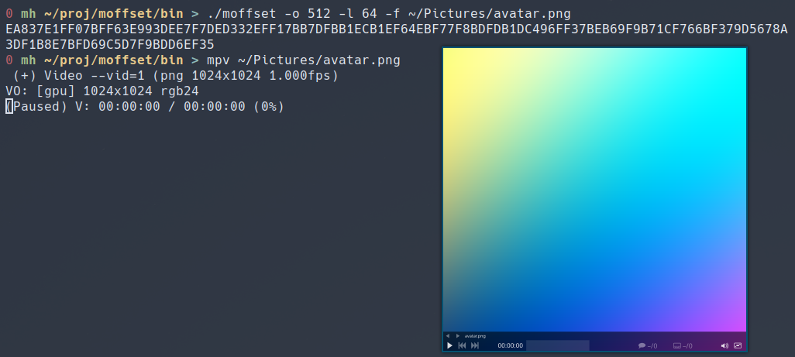

# moffset
A cli utility written in C for printing regions of a file as HEX.



## Usage
You can use it like this
```console
$ moffset -o 512 -l 64 -f somefile.png
```
- the `-o` specifies at what offset in the file to start.
- the `-l` speficies how many bytes to output.
- the `-f` specifies what file to use.

## Build
If you are on Linux you can build it using the `build.sh` file.
For example like this:
```
$ ./build.sh
```

## Contributing
If you want to modify the code you can download it using this git command:
```
$ git clone git@github.com:marvhus/moffset.git
```
